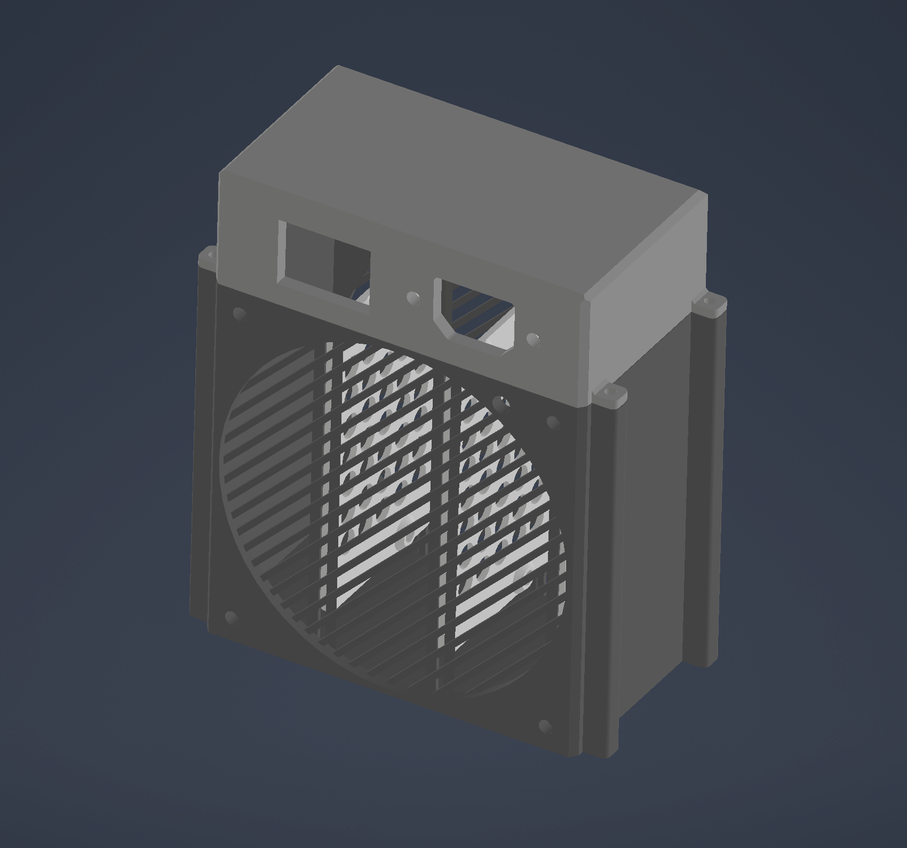
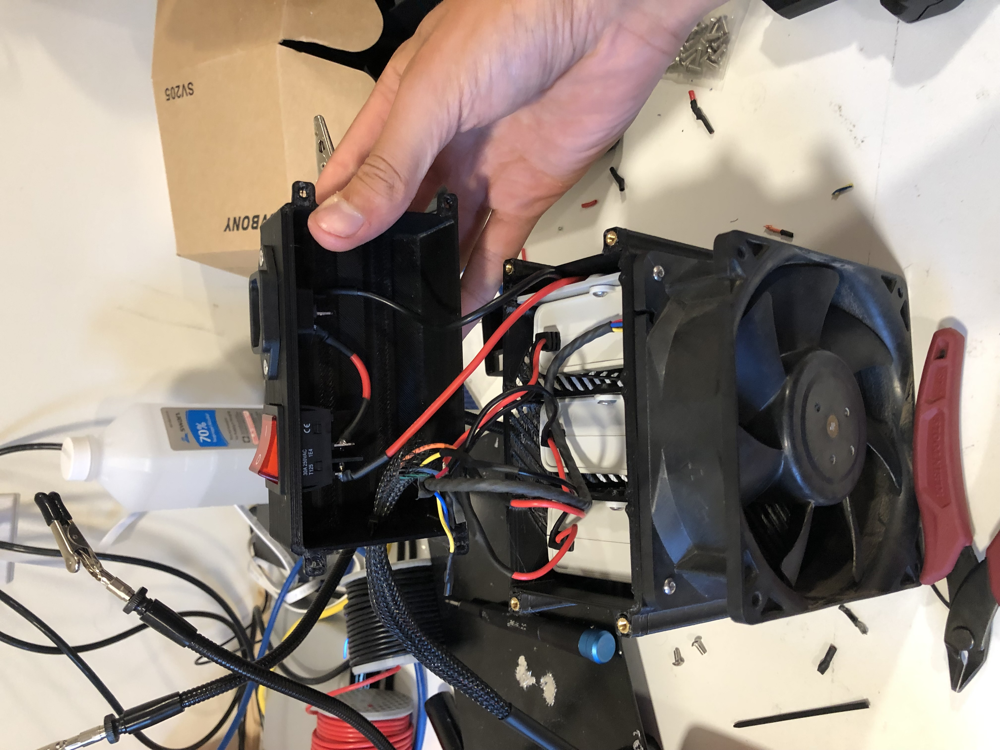

# Honda Insight Battery Charger

This repository contains the design and build details of a custom battery charger for the Honda Insight. The charger is designed to provide safe and efficient charging for the hybrid battery pack, ensuring optimal performance and longevity.

# Credit
Originally got the idea from this video on 
[YouTube](https://youtu.be/EqXRL9_Ua3o?si=K9bpzmQsqc-u3qMu)

## Electronics
The charger includes the following key electronic components:
- [Mean Well APC-35-350 LED Driver](https://www.digikey.com/en/products/detail/mean-well-usa-inc/APC-35-350/7702578)
  - 100V AC-DC Converter. I used two of these connected in series for a max of 200V. They are constant current of 350mA
    to ensure a slow charge at any capacity.  
- [Mean Well APV-35-12 Power Supply](https://www.digikey.com/en/products/detail/mean-well-usa-inc/APV-35-12/7702610)
  - 12V AC-DC Converter. This supplies power for the 12V cooling fan in the IMA assimbely as well as the 12V fan I put on
    the charger unit. These units create a substantial amount of heat and started melting the 3dprint wihtout the fan.
- [Qualtek 703W-00-07 Power Entry Connector](https://www.digikey.com/en/products/detail/qualtek/703W-00-07/1164206)
  - Power connector for AC power to AC-DC converters.

## Features
- Custom-built charger tailored for the Honda Insight hybrid battery
- Designed for slow constant current charging
- Compact and efficient assembly
- Easily replicable for DIY enthusiasts
- Can print on most 3d printers and most materials (high temp materials like abs and asa would be best)

## Assembly Overview
Below is an image of the charger assembly:

## Completed Build
Here is the charger opened up to see the wiring inside

## Usage
1. Ensure the battery charger is correctly connected to the Honda Insight battery pack.
   - Look up instruction for installing a charger to the IMA for specfic instructions
4. Monitor the charging process to prevent overcharging.
5. Disconnect safely once charging is complete.
6. If you have a method for discharging (I use incandecent bulbs) start once properly discharged. (I forget what voltage this is)

## License
This project is open-source and provided as-is. Feel free to modify and improve upon the design for personal or educational purposes.
